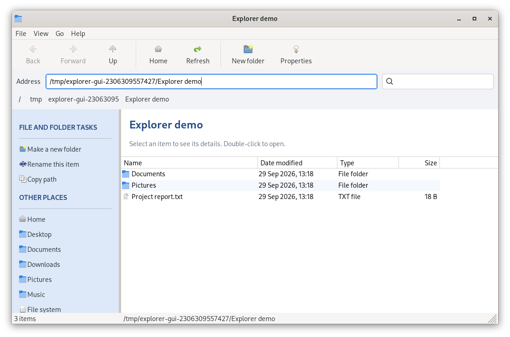

# Explorer

A native C++17 / wxWidgets file browser inspired by Windows XP Explorer, with a cleaner, resizable layout. Runs against your real filesystem; files open with the default desktop application.

## Windows release 1.2.0

The Windows ZIP now contains one `search.exe` with the browser, taskbar companion,
non-interactive background, shortcut launcher and notification-area client icon.
Run it normally for the taskbar/background, or use `search.exe --browser` for a
file window. The taskbar's Files button starts browser mode from the same binary.
A folder argument also opens browser mode. Linux keeps its existing browser-only
startup. Full Explorer replacement and third-party tray hosting remain pending.

## Features

- Back / Forward history, Up, Home, Refresh, editable address bar and clickable breadcrumbs.
- XP-inspired blue sidebar with home locations and selected-item details.
- Details and large-icon views; click a details column to sort. Folders stay first.
- Recursive, case-insensitive filename search within the current folder. Press Enter or click the search icon to search; Escape or the clear button returns to the folder.
- Search runs on a background thread, skips inaccessible subdirectories and does not follow directory symlinks. Results are capped at 50,000 matches.
- Copy, cut and paste files/folders through the Edit menu, toolbar, right-click menu or Ctrl+C/X/V. Ctrl/Shift-click selects multiple items. Paste targets the current folder; existing names are rejected without overwriting. Cut moves items when pasted within this window. Native file clipboard data also supports copying to/from other applications.
- New file creates an empty file with an editable name and extension (default `New file.txt`). Available from File, the toolbar, the context menu, or Ctrl+N.
- Delete is available from File, the toolbar, the context menu, or the Delete key in the file list. It counts all selected items and their contents (including hidden items), shows their total size, and asks before permanently deleting. It does not use Trash/Recycle Bin or follow folder symlinks. Large operations show cancellable progress; cancelling deletion may leave a partly deleted selection.
- Hidden dotfiles toggle, new folder, rename, copy path, properties and a right-click item menu.
- Native theme icons and controls, alternating detail rows, status bar and keyboard navigation.

## Build

Install a C++17 compiler, CMake 3.16+, and wxWidgets 3.2 development libraries (core and base).
On Debian/Ubuntu, the packages are `build-essential cmake libwxgtk3.2-dev`.

```sh
./b.sh
./build-host/searchwx
./build-host/searchwx /path/to/folder
```

`b.sh` uses Make and builds in `build-host`. From a Flatpak IDE it runs the build on the Linux host, like `bw.sh`. After a successful build, it updates `./build/searchwx` to point to the current executable, so the original launch command also works. Restart an already running app to load changes. Set `BUILD_DIR` to override the output directory.

For a custom wxWidgets installation:

```sh
./b.sh -DwxWidgets_CONFIG_EXECUTABLE=/path/to/bin/wx-config
```

### Build a Windows .exe on Linux

On Debian/Ubuntu, install the cross-compiler once:

```sh
sudo apt install g++-mingw-w64-x86-64-posix cmake make curl bzip2
./bw.sh
```

The result is **`build_windows/search.exe`**, a 64-bit Windows application containing both browser and companion modes. The Windows wrapper enables the shell code by default; pass `-DEXPLORER_WINDOWS_SHELL=OFF` for a browser-only build. The first build downloads checksum-verified wxWidgets 3.2.8 sources and builds a static Windows SDK locally under `build_windows/`; later builds reuse it. No system wxWidgets installation for Windows is needed. The script uses four build jobs by default (`JOBS=2 ./bw.sh` uses two). From a Flatpak IDE it runs the build on the Linux host.

The executable statically links wxWidgets and the compiler runtime; Windows system DLLs are still required. Override `WX_CONFIG` to use an existing Windows wxWidgets SDK, or `CC` / `CXX` for alternate MinGW compilers. Native Windows execution must be tested separately. `bw.sh` now configures the shared CMake targets in `build_windows/cmake` and copies the browser executable to the existing output path. Extra arguments are forwarded to CMake; cross-compiled tests are disabled by default.

## Shortcuts

| Action | Shortcut |
| --- | --- |
| Back / Forward | Alt+Left / Alt+Right |
| Parent folder / Home | Alt+Up / Alt+Home |
| Address / Search | Ctrl+L / Ctrl+F |
| Refresh | F5 |
| New file | Ctrl+N |
| Delete selected items | Delete (file list) |
| New folder | Ctrl+Shift+N |
| Rename | F2 |
| Copy / Cut / Paste | Ctrl+C / Ctrl+X / Ctrl+V |
| Copy path | Ctrl+Shift+C |
| Properties | Alt+Enter |
| Show hidden dotfiles | Ctrl+H |
| Leave search | Escape |

## Verification and scope

`./b.sh` also runs the filesystem tests. They cover shallow listing, recursive matching, hidden trees, metadata, cancellation, invalid paths, name validation and symlink cycles where supported.

The browser and optional companion are not yet a replacement for the Windows shell. Network discovery, thumbnails and shell extensions are not implemented. Hidden-file filtering currently follows dotfile naming, rather than the Windows hidden attribute. Shortcuts use standard English home subdirectories when they exist. Native widgets follow the host theme, so the appearance varies between operating systems.

Optional native GUI smoke checks (run in a desktop session):

```sh
cmake -S . -B build -DEXPLORER_GUI_TESTS=ON
cmake --build build --parallel
ctest --test-dir build --output-on-failure
```

On Linux, optional screenshot capture requires GTK 3 development headers. It exercises navigation history, recursive search, hidden results, both views, resizing, superseding an active scan, multi-file copy, cut/paste and text clipboard commands. It creates and cleans up its own temporary fixture. GTK builds save PNG layout captures in the build directory.



## Architecture and Windows shell work

`main.cpp` contains application startup. The browser implementation lives in
`browser/explorer_frame.h` and `.cpp`, built as the `explorer_browser` library.
The GUI smoke test links that same library rather than including the application
entry point. `filesystem_model.h` remains independent of wxWidgets.

`platform/services.h` provides the initial boundary for the home directory and
opening files. CMake selects `platform/windows/services.cpp` on Windows and the
portable adapter on other systems. Both initially retain the existing wxWidgets
behavior. Linux build commands and application behavior are preserved.

The [Windows shell plan](docs/windows-shell-plan.md) describes subsequent native
integration and an optional, separate desktop shell. The browser/build extraction
is implemented. An optional Windows taskbar companion now provides window
switching, a Start-menu shortcut launcher, a desktop icon preview and its own
notification-area icon. It also displays a non-interactive blue desktop background,
which can be toggled from its menu. Build it with `./bw.sh -DEXPLORER_WINDOWS_SHELL=ON` and see
[taskbar controls and limitations](docs/windows-taskbar.md). Full desktop
replacement, third-party tray hosting and shell activation remain pending. See the [compatibility checklist](docs/windows-compatibility.md)
for the native Windows validation required before shell replacement.

## Package releases

After successful builds, generate verified ZIPs using the version in CMake:

```sh
./b.sh -DCMAKE_BUILD_TYPE=Release
./bw.sh
python3 package_release.py
```

The packager requires the integrated Windows build and produces Linux and Windows
archives under `release/`, with documentation and refreshed `SHA256SUMS`. Existing
versioned releases are retained. The Windows archive contains only one executable,
`search.exe`. Native Windows runtime testing is still required.
