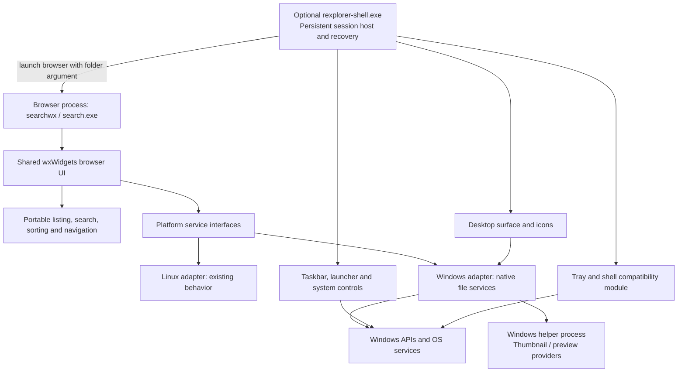

# Windows shell expansion plan

Status: proposed architecture; no shell replacement is enabled by this document.

## Goal and scope

Keep the existing Linux file browser lightweight while building an optional Windows desktop shell: desktop icons, taskbar, launcher, notification area, and native file integration. Aim for a documented feature matrix on selected Windows versions, not an unqualified promise of compatibility with every Explorer extension.

Deliver three modes:

1. **Browser (default):** the existing cross-platform application, with native Windows file services where available.
2. **Companion (Windows, opt-in):** preview the launcher and panel alongside the normal Windows shell. Explorer continues to provide its desktop and notification area.
3. **Replacement (Windows, experimental initially):** a separate shell process owns the desktop and panel for a dedicated test account. Enable only after compatibility and recovery gates pass.

## Current starting point

- `main.cpp` contains `ExplorerFrame`, commands, wxWidgets layout, and application startup.
- `filesystem_model.h` provides the portable filesystem model.
- `CMakeLists.txt` builds the browser and tests; Windows currently adds a resource file.
- `b.sh` builds and tests the Linux application through CMake.
- `bw.sh` directly compiles `main.cpp` with MinGW and a locally built wxWidgets SDK. It must be updated when implementation moves into multiple source files.
- `tests/gui_smoke.cpp` includes `main.cpp` directly; the refactor must update this coupling.
- Current gaps include native Windows hidden attributes, known folders, Recycle Bin operations, thumbnails, network discovery, and shell extensions.

## Architecture layout



The shell and browser have independent lifetimes: closing or crashing a file window must not remove the desktop. Start with command-line folder launching; add versioned, per-user IPC only when coordination requires it. Validate incoming messages and never treat them as arbitrary commands.

## Proposed screen layout

```text
+------------------------------------------------------------------------+
| Desktop: wallpaper, icons, selection, context menu, file drop targets   |
| [Computer]  [Home]  [Recycle Bin]                                        |
|                                                                        |
|        +------------------------------------------------------+        |
|        | File browser                              _  []  X   |        |
|        | Back  Forward  Up | Address / breadcrumbs | Search   |        |
|        +--------------+---------------------------------------+        |
|        | Locations    | Name          Modified    Type   Size |        |
|        | Favorites    |                                       |        |
|        | Drives       | Files / thumbnails                    |        |
|        | Network      |                                       |        |
|        +--------------+---------------------------------------+        |
|        | Selection / operation status                         |        |
|        +------------------------------------------------------+        |
| +-------------------------+                                            |
| | Launcher (when opened)  |                                            |
| | Search apps and files   |                                            |
| | Pinned / all apps      |                                            |
| | Settings / session     |                                            |
| +-------------------------+                                            |
+------------------------------------------------------------------------+
| Start | Pinned apps | Running windows | Tray | Sound Network | Clock    |
+------------------------------------------------------------------------+
```

This is the replacement-mode layout. Linux keeps its existing application window and uses the user's existing desktop environment. Companion mode previews shell controls without taking ownership of the Windows desktop.

## Protect the Linux experience

- Keep Windows headers, COM objects, libraries and shell lifecycle code inside Windows-only targets and adapters.
- Extract narrow interfaces for known locations, launching, file operations, icons, clipboard/drag-and-drop and item properties. Do not turn the portable filesystem model into a Windows shell namespace model.
- Represent virtual Windows locations separately from filesystem paths; Computer, Recycle Bin and devices cannot all be treated as `std::filesystem::path`.
- Preserve Linux shortcuts, theme behavior, dependencies, launch command and current operation semantics during extraction. Cross-platform behavior changes should be separate work.
- Add `EXPLORER_WINDOWS_SHELL=OFF` as a proposed CMake option. Reject enabling it on other platforms with a clear configuration error. Browser-only Windows builds remain available.
- Continue `./b.sh` unchanged. Preserve `./bw.sh` and `build_windows/search.exe`; migrate its final compile step to a shared CMake source/target definition while retaining SDK bootstrapping.
- Run Linux filesystem and GUI regression checks for each shared-code milestone. Windows-only development must not introduce background processes or autostart entries on Linux.

## Proposed source layout

```text
wx_search/
  main.cpp                     # Small browser entry point
  filesystem_model.h           # Portable model, initially retained
  browser/                     # ExplorerFrame, commands, reusable widgets
  platform/
    services.h                 # Small platform-neutral contracts
    linux/                     # Existing desktop behavior
    windows/                   # COM / Win32 file integrations
  shell/windows/
    main.cpp                   # Persistent shell host, mode selection
    desktop/                   # Wallpaper, icons, positioning, drops
    taskbar/                   # Window tracking, pinning, monitors
    launcher/                  # Application catalog and search
    tray/                      # Compatibility research and implementation
    session/                   # Startup, shutdown, recovery
  helpers/windows/             # Provider isolation where feasible
  tests/
    filesystem_tests.cpp
    gui_smoke.cpp
    windows/                   # Native integration and shell tests
  docs/windows-shell-plan.md
```

## Feature workstreams

| Area | Implementation direction | Completion evidence |
| --- | --- | --- |
| Native files | Known folders, hidden/system attributes, Unicode/long paths, `.lnk` handling, associations and native properties | Localized accounts, removable drives, UNC paths and permissions work on the selected Windows builds |
| File operations | Evaluate `IFileOperation` for copy/move/delete, Recycle Bin, conflicts, cancellation and elevation prompts | Cross-volume moves, partial failure, cancelled operations and recovery are correctly reported |
| Clipboard and drops | Native OLE data formats and move/copy semantics | Round trips with Explorer and representative third-party applications |
| Icons, thumbnails, previews | Windows providers with caching, timeouts and helper isolation where feasible | Slow or crashing providers cannot freeze the shell; architecture/bitness limits documented |
| Namespace and extensions | Separate virtual item model; staged support for Recycle Bin, network, devices, cloud items and context menus | Explicit compatibility matrix; classic and modern menu support evaluated separately |
| Desktop | Per-monitor surfaces, wallpaper, merged user/public desktop items, icon persistence, selection and drops | Monitor removal, DPI changes, restart and keyboard/accessibility checks |
| Taskbar | Window enumeration/events, activation, grouping, pinning, auto-hide, per-monitor placement | Normal, owned, elevated and fullscreen windows behave correctly; no focus stealing |
| Launcher | Installed application catalog, shortcuts, app launching, pins, local search, Run and session actions | Desktop and packaged apps launch correctly under a standard user account |
| Tray and notifications | First investigate third-party icon hosting, callbacks, restart registration and system controls | Representative tray apps survive shell restart; notification history and toast activation assessed separately |
| Advanced shell integration | Jump lists, taskbar progress/overlays, thumbnails, hotkeys, virtual desktops, snap and accessibility | Each behavior classified as implemented, delegated to Windows, or unsupported |
| Session lifecycle | Startup entries, session end, persistent settings, crash restart and restore-to-Explorer path | No duplicate startup launches; recovery works after forced failure and at next sign-in |

These API choices are implementation candidates to validate during their milestones. Prefer supported Windows interfaces; isolate any unavoidable compatibility-specific behavior behind a versioned module.

## Important feasibility boundaries

`Shell_NotifyIcon` is documented as an application's interface for adding icons to the existing notification area. That does not establish a supported interface for implementing a complete replacement notification-area host. Likewise, `ITaskbarList` controls the existing taskbar; it is not a ready-made replacement taskbar implementation. Treat host compatibility as research, with a go/no-go decision before committing to replacement mode. See [Microsoft's taskbar documentation](https://learn.microsoft.com/en-us/windows/win32/shell/taskbar).

An appbar can reserve space while Explorer is running using the documented [application desktop toolbar APIs](https://learn.microsoft.com/en-us/windows/win32/shell/application-desktop-toolbars). Verify work-area ownership independently when Explorer is absent; a successful companion prototype does not establish replacement-mode support.

Microsoft's [Shell Launcher](https://learn.microsoft.com/en-us/windows/configuration/shell-launcher/) supports Enterprise, Education and IoT Enterprise editions. It monitors a persistent shell process, so our configured host must stay alive. Home/Pro need a separately researched and tested deployment approach; do not advertise Shell Launcher support there. Keep the ordinary browser usable on those editions regardless.

Windows retains responsibility for composition, authentication, secure desktop/UAC and OS services. Build our own launcher UI and integrate with documented services instead of assuming Windows' private Start, Search or quick-settings interfaces can be embedded. System search indexing, notifications and virtual desktops need explicit compatibility testing with Explorer absent.

## Delivery order and exit gates

1. **Baseline and compatibility spike.** Record current Linux behavior and choose exact Windows builds/editions. In disposable Windows VMs, test tray hosting, app launching, work areas and recovery without Explorer. Create the compatibility matrix early; decide which unsupported behaviors block replacement mode.
2. **Extract platform boundaries.** Move `ExplorerFrame` out of `main.cpp`, preserve behavior, update GUI tests to use browser code directly, and unify build source lists. Gate: existing Linux tests pass, MinGW cross-build succeeds, and native Windows browser smoke checks pass.
3. **Complete Windows browser integration.** Implement native locations, attributes, operations, clipboard, shell items and provider support in small increments. Gate: Windows feature tests and unchanged Linux regression results. Ship independently of the shell.
4. **Build companion preview.** Add the optional shell executable with a windowed desktop preview, launcher and taskbar panel. Gate: usable keyboard navigation, application switching, multiple monitors and no automatic shell takeover.
5. **Build replacement sessions.** Add desktop ownership, startup handling, tray compatibility, session controls and crash recovery. Gate: the agreed mandatory feature matrix passes with Explorer absent; missing tray support blocks claiming full replacement.
6. **Package opt-in activation and rollback.** Add an edition-aware setup utility, saved prior configuration and an accessible restore command. Use a dedicated account first. Gate: activation, crash-loop recovery, uninstall and restoration of the original shell work across sign-out and reboot. Normal browser installation never changes shell settings.
7. **Harden and expand parity.** Test accessibility, mixed DPI, remote sessions, sleep/resume, disconnected shares, cloud providers and Windows updates. Publish known gaps per supported build and expand only after regression results pass.

For recovery, the persistent session host supervises child components with bounded retries and offers restoration after repeated failure. Test failure of the host itself as well as children; validate the deployment mechanism's restart policy and a recovery account independent of our shell. Restoring configuration and merely launching Explorer are distinct operations and both need verification.

## Validation and definition of done

- **Linux:** existing filesystem tests and GUI smoke checks pass; startup, memory and navigation measurements show no material regression against the recorded baseline; no new Windows dependencies.
- **Windows browser:** native execution tests cover associations, Recycle Bin, access denial, localization, links, clipboard and cancellation. Cross-compilation alone is insufficient.
- **Windows shell:** test both Explorer-present and Explorer-absent sessions; include tray callbacks, child/host crashes, multi-monitor changes, fullscreen apps, keyboard-only use and session transitions.
- **Deployment:** browser installation is unchanged by default; shell activation is explicit, edition-aware and reversible, with standard-user operation and elevation limited to setup actions that require it.
- **Parity:** every agreed feature has a tested status and supported-build entry. Defer the label “complete replacement” until all mandatory items pass; ship browser and companion improvements while compatibility gaps are being resolved.

The first implementation increment should be the browser extraction and build unification, accompanied by the Windows compatibility spike. This gives Linux a small, testable refactor and determines the hardest Windows constraints before major shell UI work.
